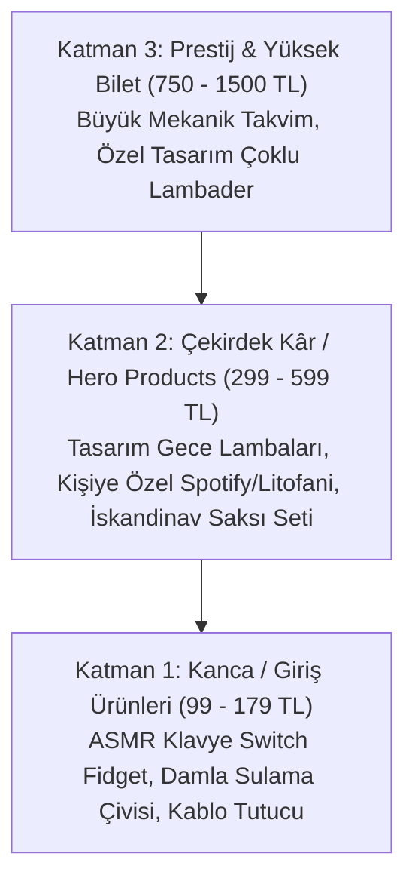

# HAIBBIES DESIGN — GENEL MÜDÜRLÜK (GM/CEO) BÜYÜME VE SATIŞ MASTER PLANI

**Tarih:** 2026  
**Hazırlayan:** Haibbies Design Genel Müdürü (AI Executive)  
**Hedef:** Sıfır Noktasından Ayda 100+ Sipariş Alan, Yüksek Kârlı 3D Tasarım & Ambiyans Markasına Dönüşüm  
**Mevcut Durum:** 1 Dolap Satışı, 5-6 Ürün, 50 Instagram Takipçisi, Esnaf Muafiyet Belgesi Aktif.

---

## 1. YÖNETİCİ ÖZETİ VE KRİTİK DURUM TEŞHİSİ (EXECUTIVE AUDIT)

Şirketimizin mevcut durumunu masaya yatırdığımızda görülen tablo şudur:
**Üretim kabiliyetimiz var, yasal zeminimiz (Esnaf Muafiyeti) hazır, ancak "Pazarlama ve Dağıtım Motorumuz" henüz çalışmıyor.**

Bu durum, 3D baskı dünyasına giren üreticilerin %90'ının düştüğü klasik **"Maker's Trap" (Üretici Tuzağı)** durumudur:
*"Ben harika bir ürün bastım, öyleyse insanlar gelip almalı."* 

Gerçek e-ticaret dünyası böyle çalışmaz. İnsanlar **filament, katman yüksekliği veya 3D plastik** satın almazlar. İnsanlar:
1. **Duygu ve Ambiyans** satın alırlar (Odayı güzelleştiren loş ışık, huzur).
2. **Prestij ve Hediye Kolaylığı** satın alırlar (Sevgilime/arkadaşıma ne alsam derdini çözen şık bir paket).
3. **Problem Çözümü** satın alırlar (Kablo karmaşasını bitiren aparat, masayı toplayan stand).

### Gece Lambası Neden Satılmıyor? (Otopsi Analizi)

| Teşhis Alanı | Mevcut Yanlış / Eksik | Olması Gereken Genel Müdür Standardı |
| :--- | :--- | :--- |
| **Görsel Sunum** | Lambayı gündüz, ışığı yanmıyorken veya beyaz floresan altında çekmek | Lambayı karanlık/loş bir odada, ahşap komodin üzerinde, sıcak sarı/amber ışık saçarken ve **video (Reels/TikTok)** ile sunmak. |
| **Kanal Seçimi** | Sadece **Dolap** üzerinden satmaya çalışmak | Dolap temelde ikinci el kıyafet platformudur. Müşteri oraya tasarım gece lambası aramaya girmez. Asıl kanallar: **Instagram + Shopier, Trendyol (Esnaf Muafiyetli) ve Etsy (Global)**. |
| **Konumlandırma** | Jenerik "Gece Lambası" olarak listelemek | Niş bir hedef kitleye satmak: "Kişiye Özel Fotoğraflı Litofani Hediye", "Bebek/Çocuk Odası İsimli Ay Dede Lambası", "Lo-Fi Masa Kurulumu İçin Akrilik Görünümlü Wabi-Sabi Abajur". |
| **Sosyal Kanıt (Social Proof)** | 1 Satış, 0 Yorum, 50 Takipçi | Bu profil müşteride "Dolandırılır mıyım? Acaba lamba bozuk mu gelir?" şüphesi yaratır. İlk 10-15 satış ve 5 yıldızlı fotoğraflı yorum derhal tetiklenmelidir. |

---

## 2. ÜRÜN MATRİSİ & FİYATLANDIRMA MİMARİSİ (HAIBBIES PRODUCT MATRIX)

Tüm ciroyu tek bir gece lambasına bağlayamayız. Başarılı bir e-ticaret markası 3 katmanlı piramit modeline dayanır:

### 1. Kanca Ürünler (Tripwire / Impulse Buys) — 99 TL - 179 TL
* **Amaç:** Kâr etmek değil; Dolap ve Shopier'de satış adedini patlatmak, 5 yıldızlı yorum toplamak ve müşteriyi Haibbies ekosistemine sokmak.
* **Ürünler:** Mekanik Switch ASMR Anahtarlık, Damla Sulama Çivisi (4'lü), Kitap Tutucu Aparat.
* **Taktik:** Müşteriye kargo dahil bedava gibi hissettiren dürtüsel fiyat.

### 2. Çekirdek Ürünler (Core Revenue / Hero) — 299 TL - 599 TL
* **Amaç:** Şirketin ana nakit akışını ve kârını yaratmak.
* **Bizim Gece Lambamız Burada!** 
  * Işık kiti kaliteli olmalı (USB kablolu veya şarjlı sıcak LED modülü).
  * Paketleme "Hediye Paketi" konseptinde olmalı.
  * İsim veya tarih özelleştirmesi ücretsiz sunulmalı.

### 3. Prestij Ürünler — 750 TL+
* **Amaç:** Mağazanın kalitesini ve tasarım vizyonunu kanıtlamak, vitrini parlatmak.

---

## 3. SATIŞ KANALLARI DAĞILIM STRATEJİSİ

Esnaf Muafiyeti Belgesi (GVK Madde 9/6 veya 9/10), evden e-ticaret yapanlar için Türkiye'deki en büyük vergi avantajıdır. KDV ödemezsiniz, defter tutma masrafınız yoktur, sadece banka hesabınıza gelen paradan küçük bir tevkifat (%2-%4) kesilir. Bu avantajı tek bir platformda harcamayacağız:

### Kanal 1: Shopier (Instagram Trafiğini Nakde Çevirme Merkezi)
* **Durum:** Hemen bugün 15 dakikada açılabilir.
* **Neden Şart?** Instagram'dan gelen birine "Dolap profilime git" derseniz %80'i satın almaktan vazgeçer (Dolap hesabı açması, uygulamayı indirmesi gerekir). Shopier'de müşteri üye olmadan kredi kartıyla 30 saniyede sipariş verir.
* **Aksiyon:** Haibbies Design adıyla şık, koyu temalı, logolu bir Shopier dükkanı açılacak.

### Kanal 2: Dolap Optimizasyonu (Mevcut Kanalı Canlandırma)
* **Fiyatlandırma:** Fiyatı 380 TL yazıp "Teklif Ver" özelliğini açın. Müşteri 299 TL teklif verdiğinde kabul edin; müşteri kazandığını hissederek alır.
* **Algoritma Tetikleme:** Dolap'ta her gün saat 20:00 - 22:00 arasında ürün fiyatında 5-10 TL indirim yapın. O ürünü beğenen herkese anlık "İndirim Yapıldı" bildirimi gider.
* **Başlık SEO'su:**
  * *Hatalı Başlık:* 3D Baskı Gece Lambası
  * *Doğru Başlık:* İskandinav Tasarım Dekoratif Masa Gece Lambası — Lo-Fi Loş Işık Hediyelik Abajur

### Kanal 3: Trendyol & Hepsiburada (Pazar Yeri Devi)
* **Kritik Bilgi:** Trendyol ve Hepsiburada, Esnaf Muafiyet Belgesi olan bireysel üreticileri pazar yerine kabul etmektedir.
* **Etki:** Dolap'ta gece lambası arayan günde 50 kişiyse, Trendyol'da günde 50.000 kişidir. Organik arama trafiği muazzamdır.
* **Aksiyon:** Esnaf muafiyet belgesi ve banka ticari hesap IBAN'ı ile Trendyol Pazaryeri Satıcı Başvurusu yapılacak.

### Kanal 4: Etsy (Global Açılım — Dolarla Satış)
* Türkiye'de 350 TL'ye (yaklaşık 10$) satamadığınız özel tasarım bir gece lambası, Etsy'de **35$ - 55$ (1.200 TL - 1.900 TL)** bandında satılır.
* Navlungo veya ShipEntegra ile mikro ihracat kapsamında yurt dışına 4-6 günde kargolanır.

---

## 4. INSTAGRAM DÖNÜŞÜM REHBERİ (50 TAKİPÇİDEN SATIŞ MOTORUNA)

Instagram'da 50 takipçi varken resim (post) paylaşmak boş odaya konuşmaya benzer. Algoritma postları keşfete düşürmez; **Reels düşürür.**

### Profil Düzenlemesi (Bio Formula)
* **İsim:** Haibbies Design | 3D Ambiyans & Hediyelik Tasarım
* **Biyografi:**
  > Evinize sıcak bir ambiyans katan özel 3D tasarımlar ✨  
  > 🌙 El emeği sıcak ışıklı gece lambaları & masa aksesuarları  
  > 📦 Özenli hediye paketi & Güvenli Kargo  
  > 👇 Koleksiyonu Keşfet & Sipariş Ver:  
  > [shopier.com/haibbiesdesign linki]

### Kanıtlanmış 3 Reels İçerik Formatı (Viral Reçetesi)

#### 1. Format: "Işığı Açtığım An" (The Ambient Reveal) — Haftada 2 Video
* **Senaryo:** Video zifiri karanlık bir odada başlar. Kamera arkadan veya yandan kadraja girer. Kişi parmağıyla lambanın düğmesine dokunur. Lamba sıcacık bir ışıkla yanar ve odanın duvarlarındaki gölgeler belirir.
* **Müzik:** Instagram trendlerinde olan lo-fi / chill / acoustic bir ses.
* **Metin (Hook):** *"Odanın havasını 1 saniyede değiştiren o küçük dokunuş..."*
* **Açıklama (Caption):** Ürünün detayları, link profilde çağrısı (CTA).

#### 2. Format: "Kız Arkadaşıma / Sevgilime Ne Hediye Alsam?" (Problem-Solution)
* **Senaryo:** *"Klasik hediyelerden sıkılanlar için tasarladığım gece lambası..."* 
* Hediye kutusu açılır, pelür kağıdı kaldırılır, ürün yakılır.
* Hediye arayan kitleye doğrudan duygusal satış.

#### 3. Format: "3D Yazıcı Hipnozu" (Maker ASMR)
* **Senaryo:** Nozülden plastiğin akışı, tabladan ürünün "çat" diye ayrılma sesi (ASMR), montajın yapılması. İnsanlar bir şeyin sıfırdan üretilmesini izlemeye bayılır.

---

## 5. İLK 10 SATIŞI TETİKLEME OPERASYONU (SOSYAL KANIT ATLAMA TAŞI)

Hiçbir müşteri yorumsuz bir dükkandan ilk alan olmak istemez. Bu psikolojik bariyeri kırmak için **Genel Müdür Operasyonu:**

1. **Çevre ve Yakın Çevre Lansmanı:** Ailenizden, yakın arkadaşlarınızdan veya iş çevrenizden 5-6 kişiye rica edin:
   * Dolap veya Shopier üzerinden sembolik bir fiyatla veya indirim kuponuyla ürünü satın alsınlar.
   * Ürün eline ulaştığında güzel bir köşede fotoğrafını çekip **5 yıldız ve detaylı, övgü dolu bir yorum** yazsınlar ("Paketleme harikaydı, ışığı odaya o kadar tatlı bir hava kattı ki bayıldım!" vb.).
2. **Kutu Açılışı Deneyimi (Unboxing):**
   * Ürünü alelade bir kargo poşetine koymayın.
   * Kahverengi kraft kutu, içine saman dolgu veya pelür kağıt.
   * El yazısıyla yazılmış samimi bir not: *"Haibbies ailesini seçtiğiniz için teşekkürler! Evinize ışık getirmesi dileğiyle..."*
   * Yanına maliyeti 2 TL olan küçük bir 3D anahtarlık hediye koyun.
   * Bu deneyimi yaşayan müşteri %90 oranında fotoğraf çekip Instagram'da sizi etiketler veya Dolap'ta 5 yıldız verir.

---

## 6. İLK 30 GÜNLÜK ACİL EYLEM TAKVİMİ (SPRINT PLANI)

| Dönem | Öncelikli Görevler | Sorumlu / Metrik |
| :--- | :--- | :--- |
| **1 - 3. Gün** | • Gece lambasını karanlık/loş ortamda 4K video ve fotoğraflarla yeniden çek. • Shopier mağazasını kur, biyografiye yerleştir. • Instagram profilini bio formülüne göre güncelle. | Görsel Kalitesi & Mağaza Altyapısı |
| **4 - 7. Gün** | • İlk 5 arkadaş/çevre siparişini organize et ve Dolap'a 5 yıldızlı fotoğraflı yorumları düşür. • Katalogdaki 2 adet hızlı satılacak kanca ürünü (Fidget Switch / Damla Sulama) listele. | Sosyal Kanıt & İlk Değerlendirmeler |
| **8 - 14. Gün** | • Günde 1 adet "Ambient Reveal" veya "Hediye Fikri" Reels videosu üret ve paylaş. • Trendyol satıcı başvurusunu esnaf muafiyeti belgesiyle tamamla. | Organik Keşfet Erişimi |
| **15 - 21. Gün** | • 5 adet küçük mikro-influencer'a (10K-30K takipçili ev/dekor hesabı) DM atarak barter (ürün hediyesi karşılığı story/reels) teklif et. • Dolap'ta akşam 20:30 fiyat indirim pinglerini uygula. | Trafik Çoğaltma |
| **22 - 30. Gün** | • Gelen verileri incele: En çok izlenen video ve tıklanan ürün hangisi? • Etsy mağaza altyapısını araştırıp ilk İngilizce listelemeyi yap. | Globalleşme & Büyüme Analizi |

---

## 7. GENEL MÜDÜRÜN FİNANSAL VE OPERASYONEL TAAHHÜDÜ

> *"Bir şirket kurmak cesaret ister; onu büyütmek ise sistem, disiplin ve doğru konumlandırma ister. Şu anki 1 satış bir başarısızlık değil, sadece motorun henüz marşa basmadığı andır. Bu stratejiyi uyguladığımızda Haibbies Design sadece lambalar satan bir hesap değil; insanların hediye almak için ilk baktığı, güvenilir bir tasarım markası haline gelecektir. Masamdayım, süreci adım adım birlikte yöneteceğiz."*
